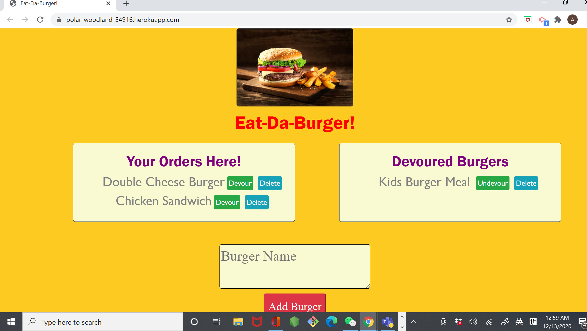

# Burger Logger : Eat-Da-Burger

# Description--A Full Stack App

This Burger Logger App is a full stack application which is built with `MySQL`, `Node`, `Express`, `Handlebars` and a homemade `ORM`.

The `MVC`（ `Model-View-Controll` ）design pattern was used to structure the stacked code files to the logic architecture. Using `Node` and `MySQL` to query and route data in the app, and `Handlebars` to dynamically generate `HTML`.

## Table of Contents

- [Useage](#Useage)
- [Functionality](#Functionality)
- [NPM-Packages--Dependencies-Used](#NPM-Packages--Dependencies-Used)
- [Directory-Structure](#Directory-Structure)
- [Screenshots](#screenshots)
- [Demo](#demo)
- [Deploy](#Deploy) - [Heroku](https://polar-woodland-54916.herokuapp.com/)
- [License](#license)
- [Questions](#questions)

## Useage

- This Eat-Da-Burger app is a simple ordering platform for burger restaurants.
  -- Users can simply use this app to input their orders in the Burger Name form, and submit the every burger name by clicking the `Add Order Button`.
- The name of burgers or burger meals will be displayed on the left side of the page in " `Your Orders Here` " box along with the two fuctional buttons `Devour` or `Delete` which allow users to decide or change their mind by clicking them.
- Once user click the `Devour` button, the order will automaticlly move to the right side of the page in " `Devoured Burgers` " box along with the two functional buttons `Undevour` or `Delete` which allow users to decide or change their mind by clicking them. `Undevour`button will move the order back to " `Your Orders Here` " box.

## Functionality

- Used `MySQL` to create a persistent database and an `Object Relational Mapper (ORM)` to retrieve data from the database.
- The four basic `CRUD` functions : `READ`, `UPDATE`, `CREATE`, `DELETE` were executed through the `MVC（ Model-View-Controll ）`design pattern.

## NPM-Packages--Dependencies-Used

`"dependencies": { "dotenv": "^8.2.0", "express": "^4.17.1", "express-handlebars": "^5.2.0", "mysql": "^2.18.1" }`

## Directory-Structure

The application repository is composed of the following directory structure which reflects the `MVC` design paradigm.

- config
  --connection.js // MySQL database connection // JAWSDB_URL for deploy Heroku
  --orm.js // Object-Relational-Mapper to query MySQL database

- controllers
  --burgers_controller.js // Express routes (router.get, post, put, delete )

- db
  --schema.sql // MySQL db schema and seeds
  --seeds.sql

- models
  --burger_models.js // Data models function with orm data for burger

- public // Site assets and client-side logic

  - assets
    - css
      - burger_style.css
    - js
      - burger_page.js // jQUERY $.ajax().then() method

- views // Handlebars templates

  - layouts
    - main.handlebars // HTML with head content and CDN links (Bootstrap , jQUERY )
  - index.handlebars // HTML body template

- package.json // NPM Packages with dependencies // NodeJS app metdata

- server.js // Express server // app = express()

## Screenshots

## Demo

## Deploy

This Note Taker application is deployed on [Heroku](https://polar-woodland-54916.herokuapp.com/).

## License

## Questions

If you have any questions about this application, please feel free to reach me via the link of my [GitHub](https://github.com/aprilyanggarwood) and my Email: <aprilyanggarwood@gmail.com>
